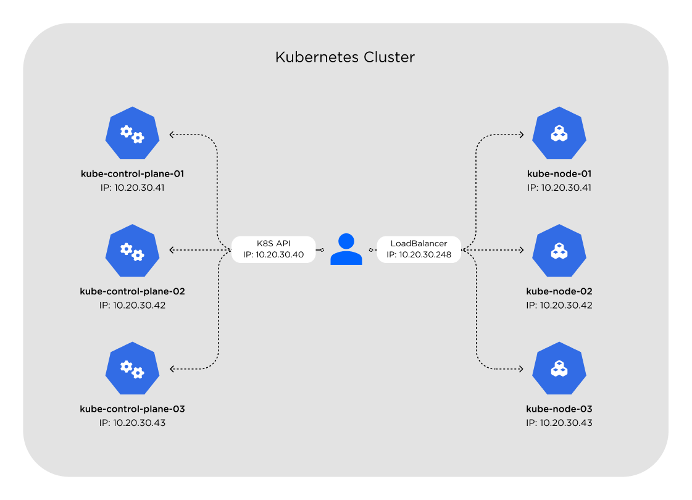

# Create Kubernetes Cluster using Kubespray

[![pre-commit badge][pre-commit-badge]][pre-commit] [![Conventional commits badge][conventional-commits-badge]][conventional-commits] [![Keep a Changelog v1.1.0 badge][keep-a-changelog-badge]][keep-a-changelog] [![MIT License Badge][license-badge]][license]

For your Home Lab env, you can use this repository with scripts for:
- create VM's via [Vagrant](https://www.vagrantup.com)
- create a Kubernetes Cluster using docker image of [Kubespray](https://github.com/kubernetes-sigs/kubespray),
- install [ArgoCD](https://argo-cd.readthedocs.io/en/stable) for apps management
- install [MetalLB](https://metallb.universe.tf) for LB on bare metal
- install [Istio](https://istio.io) for service mesh purpose,


Vagrant will create 6 VMs:

- kube-control-plane-0[1-3]: controller node (2 vcpu, 4GB RAM each)
- kube-node-0[1-3]: 1 k8s master and 2 worker nodes (2 vcpu and 4GB RAM each)

This repository was tested using


## Quick Start



Check the variables defined on the `.env` file.

**NOTE:** The bootstrap will create RSA-key by default

To create the k8s cluster just run:

```bash
vagrant up
```

Now, you can connect to the Kubernetes cluster via config `./.vagrant/provisioners/ansible/inventory/artifacts/admin.conf`:

```bash
export KUBECONFIG=$PWD/.vagrant/provisioners/ansible/inventory/artifacts/admin.conf

kubectl cluster-info
```

## Documentation

- [Requirements](docs/requirements.md)
- [References](docs/references.md)

## Some notes

- The Vagrantfile required Vagrant plugins:
    - vagrant-libvirt
    - vagrant-timezone

## pre-commit hooks

Read the [pre-commit hooks](docs/pre-commit-hooks.md) document for more info.

## git-chglog

Read the [git-chglog](docs/git-chlog.md) document for more info.

[pre-commit]: https://github.com/pre-commit/pre-commit
[pre-commit-badge]: https://img.shields.io/badge/pre--commit-enabled-brightgreen?logo=pre-commit&logoColor=white
[conventional-commits-badge]: https://img.shields.io/badge/Conventional%20Commits-1.0.0-green.svg
[conventional-commits]: https://conventionalcommits.org
[keep-a-changelog-badge]: https://img.shields.io/badge/changelog-Keep%20a%20Changelog%20v1.1.0-%23E05735
[keep-a-changelog]: https://keepachangelog.com/en/1.0.0/
[license]: ./LICENSE
[license-badge]: https://img.shields.io/badge/license-MIT-green.svg
[changelog]: ./CHANGELOG.md
[changelog-badge]: https://img.shields.io/badge/changelog-Keep%20a%20Changelog%20v1.1.0-%23E05735
